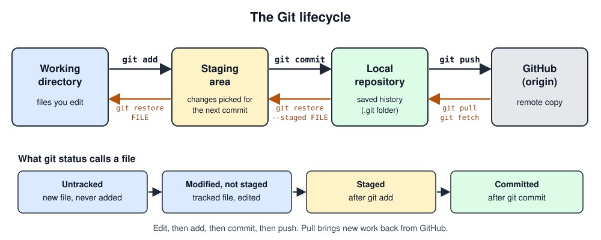
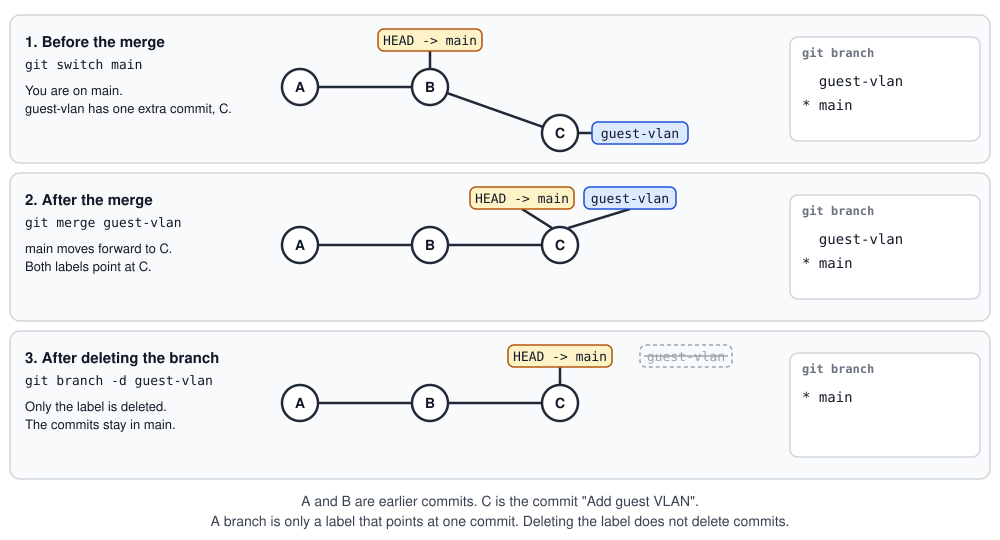
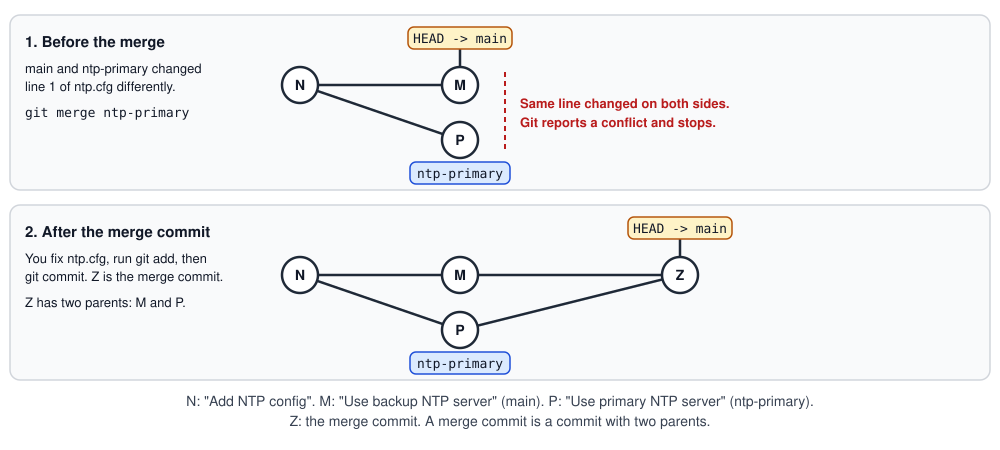

# Week 6 Lecture: Git and GitHub
**NET2008 DevOps · Algonquin College**

Follow this guide from top to bottom. You type every command in a real terminal inside GitHub Codespaces. You install nothing, and it works the same on Windows, macOS and Linux.

## How to follow this guide

- Keep this page in one browser tab and your Codespace in another.
- Every grey box is **one command**. Everything after the `#` at the end of the line is a comment that says what the command does. The terminal ignores it. Copy the whole line, paste it into the terminal with `Ctrl+V` (Windows, Linux) or `Cmd+V` (macOS), press Enter, then go to the next box.
- **You should see** shows roughly what the terminal prints. IDs like `a1b2c3d` will differ.
- Do the steps in order. Each step builds on the one before.
- All practice work happens in one folder, `~/netops-practice`.

---
## The big picture: read this first

You do not need to know anything about Git yet. Read this section once, then start Step 1.

### The problem

Imagine you keep your router configuration in a shared folder:

```text
core-rtr.cfg
core-rtr_old.cfg
core-rtr_final.cfg
core-rtr_final_v2_REAL.cfg
```

Which file is current? What changed between two of them? Who changed it, and why? What if two people edit the same file at the same time? **Version control** solves this. It keeps the full history of your files, lets you go back to any earlier version, and lets many people work on the same project safely.

### Git and GitHub are different things

| | What it is |
|---|---|
| **Git** | A program on your computer that tracks changes to your files. It works offline. |
| **GitHub** | A website that stores a copy of your Git projects online, so you can back them up, share them and work with a team. |

### Five words to know

| Word | Meaning |
|---|---|
| **Repository** (repo) | A project folder that Git tracks, together with its full history |
| **Commit** | A saved snapshot of your files, with a message that says what changed |
| **Branch** | A separate line of work, so you can experiment without breaking the main version (`main`) |
| **Remote** | A copy of the repository somewhere else, usually on GitHub. It is named `origin` |
| **Pull request** | A request on GitHub to merge one branch into another, which teammates can review first |

### The lifecycle of a change

Your work moves through four places. Learn this picture: the rest of the lecture is just walking through it.



| Place | What it is | Command that moves a change forward |
|---|---|---|
| **Working directory** | The files you edit | `git add` |
| **Staging area** | The changes you picked for the next commit | `git commit` |
| **Local repository** | The saved history, in a hidden `.git` folder | `git push` |
| **GitHub (origin)** | The copy online | |

The orange arrows go the other way: `git restore` throws away an edit, `git restore --staged` takes a file out of staging, and `git pull` brings new work down from GitHub. The purple arrow is `git revert`. It does not go back in time. It adds a new commit that cancels an older one.

The bottom row of the picture is what `git status` tells you about a file: **untracked** (new, Git has never seen it), **modified** (changed since the last commit), **staged** (picked with `git add`), **committed** (saved).

In one sentence: **you edit files, choose which changes to keep with `git add`, save them with `git commit`, and share them with `git push`.**

---
## Step 1. Open a Codespace

A Codespace is a Linux computer that GitHub runs for you. You use it in your browser.

1. Sign in at <https://github.com>.
2. Open the course repository (link in Brightspace).
3. Click the green **<> Code** button, the **Codespaces** tab, then **Create codespace on main**. Wait one to two minutes.
4. Find the **terminal** at the bottom. If it is hidden, press `Ctrl+` and the backtick key.

Your prompt looks like this. The word in brackets is your Git branch:

```text
@your-username ➜ /workspaces/net2008-devops (main) $
```

Run these five commands once, one at a time. They check your tools and keep Git from opening extra windows:

```bash
git --version  # Print the installed Git version, to prove Git works.
```

```bash
export GIT_PAGER=cat  # Stop Git from opening a scrolling viewer for long output.
```

```bash
export GIT_EDITOR=true  # Stop Git from opening a text editor when it wants a message.
```

```bash
git config --global user.name  # Show the name Git will put on your commits.
```

```bash
git config --global user.email  # Show the email Git will put on your commits.
```

You should see a Git version, then your name and email. If the last two print nothing:

```bash
git config --global user.name  "Your Name"  # Set your name for every commit you make.
```

```bash
git config --global user.email "you@example.com"  # Set your email for every commit you make.
```

When you finish for the day: <https://github.com/codespaces>, three dots, **Stop codespace**. Your files are kept.

---
## Step 2. Create a repository

A **repository** (repo) is a folder whose history Git tracks.

```bash
mkdir -p ~/netops-practice  # Create the practice folder (no error if it already exists).
```

```bash
cd ~/netops-practice  # Move the terminal into the practice folder.
```

```bash
git init -b main  # Turn this folder into a Git repository with a branch named main.
```

```bash
git status  # Show the state of your repository: new, changed and staged files.
```

You should see `Initialized empty Git repository` and `No commits yet`. `git status` is the command you will use most. Run it often.

**Remember:** Git keeps the whole history in a hidden folder named `.git` inside your project folder. Never edit it by hand. Delete it and the repository is gone.

---
## Step 3. Make commits

A **commit** is a saved snapshot of your files. Every change goes through three steps, matching the lifecycle picture you saw in "The big picture": **edit, `git add`, `git commit`**.

Create a file and check what Git sees:

```bash
printf 'hostname core-rtr-01\nntp server 10.0.0.10\n' > core-rtr.cfg  # Create core-rtr.cfg containing two lines of router config.
```

```bash
git status  # Show the state again: core-rtr.cfg should now be listed as modified.
```

You should see `core-rtr.cfg` under **Untracked files**. Stage it, then commit it:

```bash
git add core-rtr.cfg  # Stage core-rtr.cfg so it goes into the next commit.
```

```bash
git commit -m "Add core router config"  # Save the staged file as a commit with this message.
```

```bash
git log --oneline  # Show the history, one short line per commit.
```

You should see one line with an ID and your message. Write messages that start with a verb and say what changed.

Change the file and look at the difference. Lines starting with `+` were added:

```bash
echo "snmp-server community netops-ro RO" >> core-rtr.cfg  # Append one line to the end of core-rtr.cfg.
```

```bash
git status  # Show the state: both new files are listed as untracked.
```

```bash
git diff  # Show what changed in your files since the last commit (+ is added).
```

```bash
git add core-rtr.cfg  # Stage core-rtr.cfg so it goes into the next commit.
```

```bash
git commit -m "Enable SNMP read-only"  # Save the staged change as a commit with this message.
```

```bash
git log --oneline  # Show the history, one short line per commit.
```

The `git status` above shows `core-rtr.cfg` as **modified, not staged for commit**. The three states you will see:

| `git status` says | Meaning |
|---|---|
| Untracked | Git has never seen the file |
| Modified, not staged | A tracked file changed, but you have not run `git add` |
| Changes to be committed | Staged, ready for `git commit` |

`git log --oneline` prints the history, one short line per commit.

See who last changed each line of a file:

```bash
git blame core-rtr.cfg  # Show, for every line, the commit and the author that last changed it.
```

You should see one row per line: a commit ID, then in brackets the author, the date and time and the line number, then the line itself. The first two lines carry the ID of "Add core router config". A `^` in front of an ID marks the very first commit of the repository. The SNMP line carries the ID of "Enable SNMP read-only". Use `git blame` to find out who changed a line and when. Then run `git show` followed by that ID to read the commit message and the change.

---
## Step 4. Ignore files

Logs and passwords must never be committed. A `.gitignore` file tells Git to skip them:

```bash
echo "noisy log line" > router.log  # Create a log file that should never be committed.
```

```bash
echo "ADMIN_PASSWORD=do-not-commit" > secrets.env  # Create a fake secrets file that should never be committed.
```

```bash
git status  # Show the state: only .gitignore is listed now, the ignored files are hidden.
```

```bash
printf '*.log\nsecrets.env\n' > .gitignore  # Write the .gitignore file: skip every .log file and secrets.env.
```

```bash
git status  # Show the state: it should say the working tree is clean.
```

The first `git status` lists both files. The second lists only `.gitignore`. Commit it:

```bash
git add .gitignore  # Stage .gitignore so it goes into the next commit.
```

```bash
git commit -m "Add .gitignore"  # Save .gitignore as a commit.
```

**Important:** `.gitignore` only affects files Git is **not yet tracking**. If `secrets.env` had already been committed, adding it to `.gitignore` would not help: Git would keep tracking it, and it stays in the history. Ignore a file **before** you first commit it.

---
## Step 5. Undo mistakes

| Situation | Command |
|---|---|
| Edited a file (not committed), want the last saved version back | `git restore FILE` |
| A commit was wrong | `git revert COMMIT` |

Throw away an edit:

```bash
echo "THIS IS A MISTAKE" >> core-rtr.cfg  # Append a bad line to the file, as a pretend mistake.
```

```bash
git restore core-rtr.cfg  # Throw away your uncommitted edits and bring back the last saved version.
```

```bash
cat core-rtr.cfg  # Print the file to check its contents.
```

The bad line is gone for good. `git restore` cannot be undone.

Undo a commit. First make a bad one:

```bash
printf 'interface Gi0/1\n shutdown\n' >> core-rtr.cfg  # Append a bad config (shuts down an interface) to the file.
```

```bash
git add core-rtr.cfg  # Stage core-rtr.cfg so it goes into the next commit.
```

```bash
git commit -m "Shut down core uplink"  # Save the bad change as a commit, so we can practice undoing it.
```

Undoing a commit means putting the old version of the file back and saving that as a **new commit**. You already know the tools: `git restore --staged` fills the staging area, `git restore` fills the working directory, and `git commit` saves the result. By default they use the last commit. Add `--source=HEAD~1` to use the version from one commit earlier instead. `HEAD` is the latest commit, so `HEAD~1` is the commit before it, the one without the mistake. Do it by hand:

```bash
git restore --source=HEAD~1 --staged core-rtr.cfg  # Put the version from before the bad commit into the staging area.
```

```bash
git restore --source=HEAD~1 core-rtr.cfg  # Put the same version into the working directory.
```

```bash
git status  # Show the state: the old version is staged and ready to commit.
```

```bash
git commit -m "Undo core uplink shutdown"  # Save the old version as a new commit that cancels the bad one.
```

```bash
git log --oneline  # Show the history, one short line per commit.
```

You should see your undo commit on top of the bad commit. The bad commit stays in the history, and the new commit cancels it. Nothing is erased, so this is safe.

`git revert` runs those steps in one command. Make a second bad commit, then revert it:

```bash
printf 'interface Gi0/2\n shutdown\n' >> core-rtr.cfg  # Append another bad config (shuts down a second interface) to the file.
```

```bash
git add core-rtr.cfg  # Stage core-rtr.cfg so it goes into the next commit.
```

```bash
git commit -m "Shut down core downlink"  # Save the bad change as a commit, so we can practice undoing it again.
```

```bash
git revert --no-edit HEAD  # Add a new commit that cancels the latest commit, keeping the default message.
```

```bash
git log --oneline  # Show the history, one short line per commit.
```

You should see a new commit that starts with `Revert`. Both ways end the same: a new commit that cancels the wrong one. In real work use `git revert`. It also works on an older commit, not only the latest: `git revert COMMIT`.

---
## Step 6. Branches and merging

A **branch** is a separate line of work. You can experiment without touching `main`, then merge it back.



Keep this picture in view. It shows the three stages of this step.

```bash
git switch -c guest-vlan  # Create a new branch called guest-vlan and switch to it.
```

```bash
printf 'vlan 200\n name guest\n' >> core-rtr.cfg  # Append a guest VLAN config to the file (on this branch only).
```

```bash
git add core-rtr.cfg  # Stage core-rtr.cfg so it goes into the next commit.
```

```bash
git commit -m "Add guest VLAN"  # Save the VLAN change as a commit on the guest-vlan branch.
```

```bash
git switch main  # Switch back to the main branch.
```

```bash
cat core-rtr.cfg  # Print the file: the VLAN lines should not be there yet, because they are on another branch.
```

The VLAN is not on `main` yet. Merge the branch in:

```bash
git merge guest-vlan  # Bring the commits from guest-vlan into the branch you are on (main).
```

```bash
cat core-rtr.cfg  # Print the file: the VLAN lines are now on main.
```

```bash
git log --oneline --graph --all  # Show every branch in the history as a graph.
```

```bash
git branch  # List your local branches. The star marks the branch you are on.
```

You should see both branches. `guest-vlan` still exists even though its work is merged:

```text
  guest-vlan
* main
```

Delete the branch, then list the branches again:

```bash
git branch -d guest-vlan  # Delete the guest-vlan branch. Its work is already merged into main.
```

```bash
git branch  # List your local branches again.
```

You should see only `main`:

```text
* main
```

The VLAN lines are still on `main`. Deleting a branch deletes only its label, not the commits.

---
## Step 7. Fix a merge conflict

A **conflict** happens when two branches change the **same line**. Git cannot choose, so you do. Conflicts are normal.



Set it up: the same line is changed two different ways.

```bash
echo "ntp server 10.0.0.10" > ntp.cfg  # Create ntp.cfg with one line.
```

```bash
git add ntp.cfg  # Stage ntp.cfg so it goes into the next commit.
```

```bash
git commit -m "Add NTP config"  # Save ntp.cfg as a commit.
```

```bash
git switch -c ntp-primary  # Create a new branch called ntp-primary and switch to it.
```

```bash
echo "ntp server 10.0.0.11" > ntp.cfg  # Overwrite ntp.cfg with a different server (this branch).
```

```bash
git commit -a -m "Use primary NTP server"  # Stage all changes to tracked files and commit them in one step.
```

```bash
git switch main  # Switch back to the main branch.
```

```bash
echo "ntp server 10.0.0.12" > ntp.cfg  # Overwrite the same line with another server (on main).
```

```bash
git commit -a -m "Use backup NTP server"  # Stage all changes to tracked files and commit them in one step.
```

```bash
git merge ntp-primary  # Merge ntp-primary into main. Both changed the same line, so this conflicts.
```

```bash
cat ntp.cfg  # Print ntp.cfg to see the conflict markers Git inserted.
```

You should see `CONFLICT` and a file that looks like this:

```text
<<<<<<< HEAD
ntp server 10.0.0.12
=======
ntp server 10.0.0.11
>>>>>>> ntp-primary
```

The top half is your side, the bottom half is the other side. You decide what the file should say and delete the three marker lines. We keep both servers:

```bash
printf 'ntp server 10.0.0.11 prefer\nntp server 10.0.0.12\n' > ntp.cfg  # Replace the conflicted file with the final text we chose (markers removed).
```

```bash
git add ntp.cfg  # Mark the conflict as resolved by staging the fixed ntp.cfg.
```

```bash
git commit -m "Merge ntp-primary, keep both NTP servers"  # Finish the merge with a message that says what you decided.
```

```bash
git branch -d ntp-primary  # Delete the ntp-primary branch. Its work is already merged.
```

```bash
git log --oneline --graph --all  # Show every branch in the history as a graph.
```

You should see your merge commit on top, with two lines joining into it. That is Z in the picture: a commit with two parents, one from each branch.

The markers are `<<<<<<<`, `=======` and `>>>>>>>`. The three steps for any conflict: **edit the file, `git add` it, `git commit`**.

---
## Step 8. Put your repository on GitHub

**GitHub** stores a copy of your repository online. That copy is called a **remote**, named `origin`. You create the empty copy in your browser, then connect your folder to it.

**Why SSH:** a Codespace is logged in to GitHub with a built-in login that only covers the course repository. A push to your own repository over `https://` fails with `403`, which means permission denied. An SSH key belongs to your own GitHub account, so it works for every repository you own.

### 8a. Create an empty repository on GitHub

1. In your browser, open <https://github.com/new>.
2. **Repository name:** type `netops-practice`.
3. Select **Public**.
4. Leave **Add a README file**, **Add .gitignore** and **Choose a license** off. The repository must be empty.
5. Click **Create repository**. Keep the page open.

### 8b. Create an SSH key in your Codespace

An SSH key is a pair of files. The **private key** stays in your Codespace and is never shared. The **public key** is the one you give to GitHub.

```bash
ssh-keygen -t ed25519 -C "$(git config --global user.email)" -f ~/.ssh/id_ed25519 -N ""  # Create a new SSH key pair with no passphrase, labelled with your email.
```

```bash
cat ~/.ssh/id_ed25519.pub  # Print the public key so you can copy it.
```

You should see one long line that starts with `ssh-ed25519` and ends with your email.

### 8c. Add the public key to GitHub

1. Select the whole line that `cat` printed and copy it.
2. On github.com, click your profile picture (top right), then **Settings**, then **SSH and GPG keys**, then **New SSH key**.
3. **Title:** `codespace`. **Key type:** **Authentication Key**. **Key:** paste the line. Click **Add SSH key**.

Test the connection:

```bash
ssh -T git@github.com  # Test the SSH login to GitHub. If it asks "Are you sure you want to continue connecting", type yes.
```

You should see `Hi YOUR-USERNAME! You've successfully authenticated, but GitHub does not provide shell access.` That message means it worked.

### 8d. Connect your folder and push

On the empty repository page, click the **SSH** tab and copy the URL. It looks like `git@github.com:YOUR-USERNAME/netops-practice.git`. Use your own username.

```bash
git remote add origin git@github.com:YOUR-USERNAME/netops-practice.git  # Link your empty GitHub repo to this folder under the name origin.
```

```bash
git remote -v  # List the remotes (online copies) this repository knows about.
```

```bash
git push -u origin main  # Upload main to origin and remember it as the default for git push and git pull.
```

Reload the repository page on GitHub. Your files and commits are there.

`git push -u origin main` uploads `main` to the remote named `origin` and sets it as the **upstream** of your local `main`. After that you can type just `git push` and `git pull`.

If `git remote add` says `remote origin already exists`, change the URL instead:

```bash
git remote set-url origin git@github.com:YOUR-USERNAME/netops-practice.git  # Change the URL that origin points to.
```

**Never use `git push --force` on a shared branch.** It can overwrite commits on GitHub and destroy your teammates' work.

---
## Step 9. Pull changes from GitHub

Other people change the repository too. You play the teammate by editing on GitHub.

1. In the browser, open `core-rtr.cfg` in your repository and click the **pencil** icon.
2. Add the line `logging host 10.0.0.50` at the bottom.
3. Click **Commit changes**, type the message `Send syslog to collector`, and commit.

Your Codespace does not have it yet. Download it:

```bash
git pull  # Download new commits from GitHub and merge them into your branch.
```

```bash
cat core-rtr.cfg  # Print the file: the new syslog line from GitHub should be there.
```

You should see the new line in your file.

| Command | What it does |
|---|---|
| `git fetch` | Downloads new commits but does **not** change your branch |
| `git pull` | `git fetch` and then a merge into your branch |
| `git push` | Uploads your commits to GitHub |

Habit: `git pull` before you start, `git push` when you finish.

---
## Step 10. A pull request

On a team, nobody edits `main` directly. You work on a branch, push it, and open a **pull request** (PR): a request to merge changes from one branch into another, which teammates can review first.

```bash
git switch -c add-banner  # Create a new branch called add-banner and switch to it.
```

```bash
echo "banner motd Authorized access only" >> core-rtr.cfg  # Append a login banner line to the file.
```

```bash
git add core-rtr.cfg  # Stage core-rtr.cfg so it goes into the next commit.
```

```bash
git commit -m "Add login banner"  # Save the banner change as a commit.
```

```bash
git push -u origin add-banner  # Upload the add-banner branch to GitHub and set it as its upstream.
```

Open the pull request in your browser:

1. Open your `netops-practice` repository on github.com.
2. Click **Compare & pull request** in the yellow banner. If there is no banner, open the **Pull requests** tab, click **New pull request**, then set **base** to `main` and **compare** to `add-banner`.
3. Check the branch names: **base: main** on the left and **compare: add-banner** on the right.
4. **Title:** `Add login banner`. **Description:** `Adds a login banner.`
5. Click **Create pull request**.
6. Open the **Files changed** tab. It shows the one line you added. A teammate would review it here.
7. Go back to the **Conversation** tab. Click **Merge pull request**, then **Confirm merge**.

Then bring `main` up to date:

```bash
git switch main  # Switch back to the main branch.
```

```bash
git pull  # Bring your local main up to date with GitHub, including the merged pull request.
```

```bash
git log --oneline --graph -5  # Show the last 5 commits as a short list with a branch graph.
```

You should see your banner commit on `main`.

---
## Step 11. Clone a repository

`git clone` downloads a full copy of a repository that already exists on GitHub: all files, the whole history, and the `origin` remote already set. Use `git init` to start a new project. Use `git clone` to get an existing one.

Clone your own repository into a new folder:

```bash
cd ~  # Move to your home folder, outside any other repository.
```

```bash
git clone git@github.com:YOUR-USERNAME/netops-practice.git netops-copy  # Download a full copy of your repo into a new folder named netops-copy.
```

```bash
cd netops-copy  # Move into the clone.
```

```bash
git log --oneline  # Show the history: every commit came with the clone.
```

```bash
git remote -v  # Show the remotes: origin already points to the URL you cloned.
```

You should see all your commits and an `origin` line with your SSH URL. Without the last word in the clone command, Git names the folder after the repository.

| Command | What it does |
|---|---|
| `git clone URL` | Copy the repo into a folder named after it |
| `git clone URL NAME` | Copy the repo into a folder called `NAME` |
| `git clone -b BRANCH URL` | Copy the repo and start on `BRANCH` instead of the default branch |
| `git clone --depth 1 URL` | Copy only the latest snapshot, without the history (faster for big repos) |

Private repositories need the SSH key from Step 8. Remove the copy when you are done:

```bash
cd ~  # Go back to your home folder.
```

```bash
rm -rf ~/netops-copy  # Delete the cloned copy. Your repo on GitHub is not affected.
```

---
## Finish

```bash
git status  # Show the state of your repository. It should be clean.
```

You should see `nothing to commit, working tree clean`. Stop your Codespace (Step 1). To start over, delete the practice folder:

```bash
cd ~  # Go back to your home folder.
```

```bash
rm -rf ~/netops-practice  # Delete the practice folder and everything in it. This cannot be undone.
```

If you will not use this Codespace again, also remove its key from GitHub: **Settings**, **SSH and GPG keys**, then **Delete** next to `codespace`.

---
## Command cheat sheet

| I want to... | Command |
|---|---|
| Start a repository | `git init -b main` |
| See what is going on | `git status` |
| Stage / commit | `git add FILE` / `git commit -m "message"` |
| See changes | `git diff` |
| See history | `git log --oneline --graph --all` |
| See who changed a line | `git blame FILE` |
| Discard an edit | `git restore FILE` |
| Undo a commit safely | `git revert COMMIT` (restore the old version, then commit) |
| New branch / switch branch | `git switch -c NAME` / `git switch NAME` |
| List branches / delete a branch | `git branch` / `git branch -d NAME` |
| Merge a branch | `git merge NAME` |
| Finish a conflict | edit, `git add FILE`, `git commit` |
| Publish a repo | Create an empty repo on github.com, then `git remote add origin git@github.com:USER/NAME.git` and `git push -u origin main` |
| Copy an existing repo from GitHub | `git clone URL` |
| Download only / download and merge | `git fetch` / `git pull` |
| Upload | `git push` |

## If something goes wrong

| Problem | What to do |
|---|---|
| `fatal: not a git repository` | Wrong folder. Run `cd ~/netops-practice`. |
| `Author identity unknown` | Run the two `git config --global` lines in Step 1. |
| Terminal shows `>` and waits | Press `Ctrl+C` and retype the command. |
| A strange editor opens (vim) | Press `Esc`, type `:q!`, Enter. Run `export GIT_EDITOR=true`. |
| `Updates were rejected` on push | Run `git pull`, then `git push`. |
| `remote origin already exists` | Run `git remote set-url origin git@github.com:YOUR-USERNAME/netops-practice.git`. |
| `Permission denied (publickey)` | GitHub does not have your public key. Redo 8b and 8c in Step 8. |
| `403` when you push | You used an `https://` URL. Switch to the SSH URL with `git remote set-url` (Step 8). |
| `CONFLICT` | Follow Step 7. |
| Everything is a mess | `cd ~`, `rm -rf ~/netops-practice`, start again at Step 2. |
